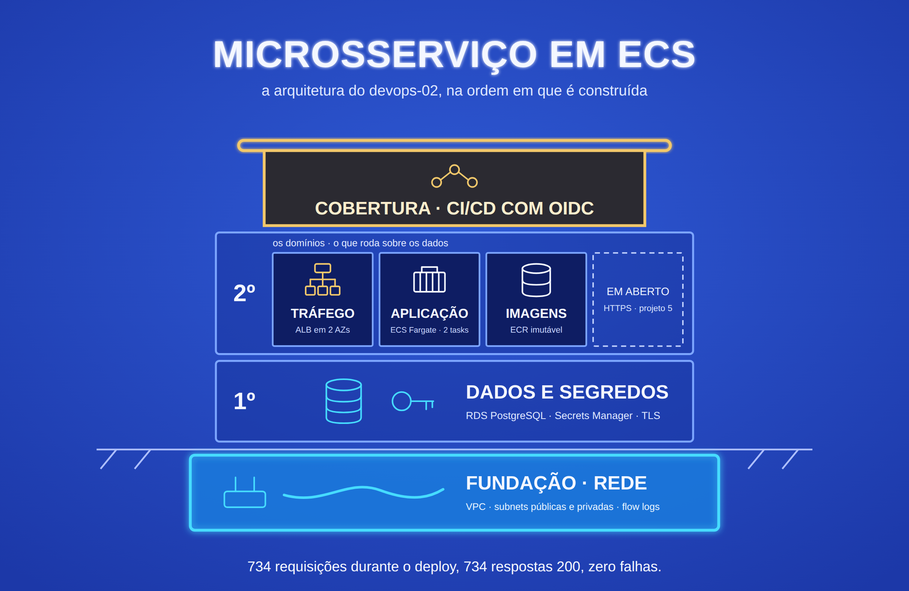

# devops-02-ecs-microservice

API com PostgreSQL rodando em ECS Fargate atrás de um ALB, com deploy sem
downtime, banco em rede privada, senha que nunca passa pelo código nem pelo
state, e um pipeline que publica na AWS sem nenhuma credencial guardada.

**Projeto 2 de 5 do portfólio DevOps** · Nível: intermediário ·
Anterior: [devops-01-ec2-cicd](https://github.com/robson-devops/devops-01-ec2-cicd)


## Stack

`AWS ECS Fargate` `RDS PostgreSQL` `ALB` `ECR` `Terraform (módulos)` `GitHub Actions` `OIDC` `Secrets Manager` `CloudWatch` `Python/FastAPI`

## O que este projeto resolve do anterior

O Projeto 1 terminou declarando suas limitações. Este existe para fechar a
maior parte delas:

| Limitação do Projeto 1 | Como foi resolvida aqui |
|---|---|
| Instância única, sem alta disponibilidade | 2 tasks em AZs diferentes atrás de um ALB |
| Janela de indisponibilidade no deploy | Rolling deploy com health check — **medido: 734 requisições, 0 falhas** |
| Access keys de longa duração nos secrets | OIDC: o pipeline assume uma role por 1 hora, nada fica guardado |
| State do Terraform local | Backend S3 cifrado, versionado e com lock nativo, criado e destruído pelo próprio projeto |
| Terraform monolítico | Seis módulos, seguindo o style guide da HashiCorp |
| Aplicação sem estado | PostgreSQL no RDS, em subnet privada |
| Sem HTTPS | **Continua aberta** — ver [Limitações](#limitações-conhecidas) |

## Arquitetura

Diagrama e fluxo completos em [`docs/architecture.md`](docs/architecture.md).
O fluxo de autenticação do pipeline está em [`docs/oidc-flow.md`](docs/oidc-flow.md).

```
git push → teste de integração com Postgres → ECR (tag = SHA)
        → OIDC → nova revisão da task definition → rolling deploy no ECS
usuário → ALB (2 AZs) → tasks Fargate → RDS PostgreSQL (subnet privada, TLS)
```

## Decisões de Arquitetura

**ECS Fargate, não EC2 nem EKS.** O salto do Projeto 1 é tirar o servidor da
equação: sem SO para corrigir, sem capacidade para planejar. EKS resolveria o
mesmo problema com uma camada de operação a mais que uma aplicação só não
justifica — ele entra no Projeto 3, onde há motivo para ele.

**A senha do banco nunca existe no código, no state nem no pipeline.** O RDS
gera e rotaciona a credencial no Secrets Manager (`manage_master_user_password`),
e o ECS injeta só a chave `password` do secret no momento em que a task sobe. Não
há variável de senha em nenhum módulo.

**O banco só aceita conexão de um security group, nunca de uma faixa de IP.** A
regra de entrada do RDS referencia o security group das tasks. Nada fora dele
alcança a porta 5432, mesmo dentro da VPC.

**TLS obrigatório até o banco.** O parameter group liga `rds.force_ssl`, e a
aplicação conecta com `sslmode=require`. "Rede interna" não é garantia de
confidencialidade.

**Duas roles distintas para a task.** A *execution role* é usada pelo agente do
ECS antes do container existir — puxa a imagem, escreve log, lê o secret. A
*task role* é a do container em execução e só permite o ECS Exec. A aplicação
não chama API da AWS, então não recebe permissão nenhuma.

**Sistema de arquivos somente leitura.** O container não escreve em disco; com
`readonlyRootFilesystem`, quem comprometer o processo não consegue gravar
binário nem alterar código. Só `/tmp` é gravável, em volume efêmero.

**Liveness e readiness separados.** `/health` não toca no banco: se o RDS
oscilar, as tasks não são mortas à toa. `/ready` testa o banco, e é ele que o
ALB usa para decidir quem recebe tráfego.

**Deploy que se desfaz sozinho.** `minimum_healthy_percent = 100` e
`maximum_percent = 200` garantem que nunca há menos tasks saudáveis que o
necessário durante a troca. O circuit breaker com rollback volta para a revisão
anterior se o deploy não estabilizar, e o pipeline espera a estabilização —
então deploy ruim deixa o pipeline vermelho, não a produção quebrada.

**Pipeline sem credencial.** O GitHub Actions troca um token OIDC assinado por
credenciais de 1 hora. A trust policy aceita apenas este repositório e a branch
`main`, e o `iam:PassRole` é restrito às roles da task e ao serviço
`ecs-tasks.amazonaws.com` — sem isso, a role do pipeline poderia escalar
privilégio.

**Imagem imutável e rastreável.** O ECR é `IMMUTABLE` e o pipeline publica só a
tag do SHA do commit. O build desliga `--provenance` e `--sbom` para gerar um
manifesto único: com eles, o BuildKit publica um índice com filhos sem tag, que
a regra de expiração de imagens sem tag do ECR poderia apagar.

**Nada fica para trás na conta.** O projeto cria tudo de que precisa e o
destroy apaga tudo, inclusive o que costuma sobrar:

- o bucket do state, criado pela camada `bootstrap/` e apagado por último;
- o provider OIDC do GitHub, criado pelo `pipeline_identity`;
- os log groups que a AWS criaria sozinha, sem retenção e fora do Terraform (os
  logs exportados pelo RDS e as métricas do Container Insights). Eles são
  criados antes, com o nome exato que o serviço usa, e a AWS passa a usá-los;
- as revisões de task definition registradas pelo pipeline, que não pertencem
  ao state e são removidas num passo próprio do encerramento.

O [`scripts/verificar-cobranca.sh`](scripts/verificar-cobranca.sh) confere o
resultado: depois do ciclo completo, a conta volta sem nenhum recurso do
projeto.

**Rede mais segura que o padrão da AWS.** O security group default da VPC é
esvaziado (ele nasce liberando tráfego entre membros) e os flow logs registram
o tráfego aceito e recusado.

## Trade-offs Avaliados

| Decisão | Escolhido | Alternativa | Critério |
|---|---|---|---|
| Orquestração | ECS Fargate | EKS / ECS em EC2 | Menor operação para uma aplicação; EKS vem no Projeto 3 |
| Saída das tasks para a internet | IP público na task | NAT Gateway | NAT custa ~US$32/mês fixo só para puxar imagem; a task só aceita tráfego do ALB |
| Senha do banco | Gerenciada pelo RDS no Secrets Manager | Variável Terraform / `random_password` | Nenhuma das alternativas evita que a senha passe pelo state |
| Autenticação do pipeline | OIDC | Access key em secret | Credencial de 1 hora, amarrada ao repositório e à branch |
| Lock do state | `use_lockfile` nativo do S3 | Tabela DynamoDB | Nativo desde o Terraform 1.10; a tabela virou recurso a mais para pagar e manter |
| Bucket do state | Camada `bootstrap/` com state local | Bucket criado à mão via CLI | Criado à mão, o bucket fica fora de qualquer destroy e sobra na conta |
| Log groups dos serviços AWS | Criados pelo Terraform antes do serviço | Deixar a AWS criar | Criados pela AWS, ficam sem retenção e sobrevivem ao destroy |
| Imagem de referência na task definition | Terraform cria, pipeline atualiza (`ignore_changes`) | Terraform gerencia cada deploy | Senão o próximo `terraform apply` reverteria a produção para a imagem do código |
| Chaves de criptografia | Gerenciadas pela AWS | KMS próprio | KMS próprio custa ~US$1/mês por chave e se justifica com exigência de controle da chave |
| Log de consultas do banco | `ddl` + consultas acima de 1s | `log_statement = all` | Registrar tudo grava também os dados que passam nas consultas |
| Schema do banco | `create_all` no startup | Alembic | Suficiente para uma tabela; ferramenta de migração entra quando houver evolução de schema |

## Melhorias Mensuráveis

Medido na AWS, não estimado:

| Métrica | Resultado |
|---|---|
| Disponibilidade durante um deploy completo | **734 requisições em 6min32s, 734 respostas 200, 0 falhas** |
| Credenciais estáticas da AWS no GitHub | **0** (Projeto 1: um par de access keys) |
| Tempo de vida da credencial do pipeline | **1 hora** (Projeto 1: indefinido) |
| Portas do banco alcançáveis da internet | **0** |
| Zonas de disponibilidade servindo tráfego | **2** (Projeto 1: 1) |
| Varredura de segurança do Terraform (`checkov`) | **233 passaram, 0 falharam**, 35 exceções justificadas no código |
| Recursos do projeto na conta após o ciclo completo | **0**, verificado pelo `scripts/verificar-cobranca.sh` |
| Deploys rastreáveis ao commit | **100%** — tag imutável com o SHA |

Como o teste de zero downtime foi feito: um loop consultando `/ready` pelo ALB a
cada 0,2s enquanto `aws ecs update-service --force-new-deployment` trocava as
duas tasks. Procedimento completo em [`docs/validacao-aws.md`](docs/validacao-aws.md).

## Limitações Conhecidas

- **Sem HTTPS.** O ALB só escuta em HTTP. Certificado ACM exige um domínio com
  DNS gerenciável, e o domínio disponível não está hospedado no Route 53. Um
  CloudFront na frente do ALB daria HTTPS no domínio `*.cloudfront.net` sem
  domínio próprio. Resolvido no Projeto 5.
- **A aplicação conecta com o usuário administrador do banco.** O correto é um
  usuário da aplicação com permissão só nas tabelas dela, criado por migração.
- **TLS sem verificação do certificado.** `sslmode=require` cifra, mas não
  confere quem responde. `verify-full` exige embutir o bundle de CA do RDS na
  imagem.
- **RDS em uma zona só.** `multi_az` existe como variável, mas fica desligado
  porque dobra o custo da instância.
- **Sem autoscaling.** O serviço roda com 2 tasks fixas.
- **State do bootstrap é local.** O state que conhece o bucket fica em
  `bootstrap/terraform.tfstate`, fora do Git. Se ele se perder antes do
  `bootstrap destroy`, o bucket precisa ser apagado à mão. O script de
  verificação aponta o bucket nesse caso.
- **Bootstrap manual da primeira imagem.** O serviço não sobe sem imagem no ECR,
  então a primeira é publicada à mão antes do apply completo. Ver *Como executar*.

## Estrutura

```
.
├── app/                         # API FastAPI + Dockerfile
├── bootstrap/                   # bucket do state (state local)
├── terraform/
│   ├── terraform.tf             # versões e backend S3
│   ├── providers.tf
│   ├── main.tf                  # composição dos módulos
│   ├── variables.tf · outputs.tf · locals.tf
│   └── modules/
│       ├── network/             # VPC, subnets, rotas, flow logs, SG default
│       ├── ecr/                 # repositório imutável e lifecycle
│       ├── rds/                 # PostgreSQL, parameter group, SG
│       ├── alb/                 # ALB, target group, logs de acesso
│       ├── ecs_service/         # cluster, task definition, serviço, roles
│       └── pipeline_identity/   # provider OIDC e role do GitHub Actions
├── scripts/
│   └── verificar-cobranca.sh    # confere que nada ficou na conta
├── .github/workflows/ci-cd.yml
└── docs/                        # arquitetura, OIDC e validação na AWS
```

## Pré-requisitos

### Ferramentas

Terraform `>= 1.14`, AWS CLI v2, Docker e GitHub CLI (`gh`).

> No macOS, o formula `terraform` do Homebrew core está parado na 1.5.7. Use o
> tap oficial: `brew install hashicorp/tap/terraform`.

### Identidades na AWS

| Identidade | O que é | Como obter |
|---|---|---|
| **Operador** | Quem roda o Terraform da sua máquina | Usuário IAM seu, com permissão em VPC, EC2, ECS, ECR, RDS, ELB, IAM (inclusive provider OIDC), S3, CloudWatch Logs e Secrets Manager |
| **Pipeline** | O GitHub Actions | Role criada pelo próprio Terraform (`pipeline_identity`) — nenhuma chave a gerar |
| **Tasks** | Os containers | Roles criadas pelo Terraform (`ecs_service`) |

### Login na AWS e no GitHub

O Terraform e a AWS CLI usam a mesma credencial, lida do perfil configurado na
sua máquina. Sem ela, o primeiro `terraform apply` falha com
`No valid credential sources found`.

Escolha uma das formas, conforme a sua conta:

**Usuário IAM com access key:**

```bash
aws configure
```

Informe a access key, a secret key, a região `us-east-1` e o formato `json`.

**AWS IAM Identity Center (SSO):**

```bash
aws configure sso
aws sso login --profile <seu-perfil>
export AWS_PROFILE=<seu-perfil>
```

A sessão SSO expira. Se o Terraform acusar token expirado no meio do trabalho,
repita o `aws sso login`.

Confira qual identidade está ativa antes de qualquer comando. A conta que
aparecer aqui é onde tudo será criado:

```bash
aws sts get-caller-identity
```

O `gh` precisa estar autenticado no dono do repositório, para gravar o secret
do pipeline:

```bash
gh auth login
gh auth status
```

### Provider OIDC do GitHub

O projeto cria o provider e o destroy o remove (`create_oidc_provider = true`,
padrão). Ele é único por conta AWS, então confira antes se outro projeto já o
criou:

```bash
aws iam list-open-id-connect-providers \
  --query "OpenIDConnectProviderList[?contains(Arn, 'token.actions.githubusercontent.com')].Arn" \
  --output text
```

- Se vier vazio, mantenha o padrão.
- Se imprimir um ARN, use `create_oidc_provider = false`: o projeto só o
  referencia e não o apaga no destroy.

### Seu repositório

Se você fez fork, ajuste `github_repository` para `seu-usuario/seu-repo`. É o
valor que a trust policy amarra — com o nome errado, o pipeline é recusado.

## Como executar

Todos os comandos rodam da raiz do projeto.

**1. Criar o bucket do state.** A camada `bootstrap/` tem state local, porque
não pode guardar o próprio state no bucket que ela cria. O nome do bucket é
gerado pela AWS a partir do prefixo `devops-02-tfstate-`.

```bash
terraform -chdir=bootstrap init
terraform -chdir=bootstrap apply
```

**2. Inicializar o projeto apontando para esse bucket.** Se a pasta
`terraform/` já foi inicializada antes com outro bucket, acrescente
`-reconfigure`.

```bash
terraform -chdir=terraform init \
  -backend-config="bucket=$(terraform -chdir=bootstrap output -raw state_bucket_name)"
```

**3. Criar só o registro de imagens.** O serviço ECS não sobe sem imagem, e o
repositório é criado no mesmo apply. Por isso o primeiro apply é restrito ao
módulo ECR.

```bash
terraform -chdir=terraform apply -target=module.ecr
```

**4. Publicar a imagem de bootstrap.** `--platform linux/amd64` é obrigatório
em Mac com Apple Silicon, porque a task é X86_64. Com `--provenance` e `--sbom`
desligados, o build gera manifesto único, sem índice.

```bash
REGISTRY="$(aws sts get-caller-identity --query Account --output text).dkr.ecr.us-east-1.amazonaws.com"

aws ecr get-login-password --region us-east-1 \
  | docker login --username AWS --password-stdin "$REGISTRY"

docker build --platform linux/amd64 --provenance=false --sbom=false \
  -t "$REGISTRY/devops-02-dev:bootstrap" app

docker push "$REGISTRY/devops-02-dev:bootstrap"
```

**5. Criar o restante.** O RDS leva de 5 a 10 minutos.

```bash
terraform -chdir=terraform apply
```

**6. Configurar o pipeline.** O único secret é o ARN da role: um identificador,
não uma credencial. A role é recriada a cada ciclo, então o secret também.

```bash
gh secret set AWS_ROLE_ARN --body "$(terraform -chdir=terraform output -raw pipeline_role_arn)"
```

A partir daqui, todo push na `main` que altere `app/` testa, publica e faz o
deploy.

**7. Acessar.** Logo depois do apply o ALB responde `503` por 1 a 3 minutos,
enquanto as tasks sobem e passam no health check.

```bash
curl "$(terraform -chdir=terraform output -raw application_url)/ready"
```

**8. Encerrar sem deixar nada na conta.**

```bash
terraform -chdir=terraform destroy
```

As revisões de task definition registradas pelo pipeline não estão no state.
Desregistre e apague:

```bash
for td in $(aws ecs list-task-definitions --family-prefix devops-02-dev --status ACTIVE --query "taskDefinitionArns[]" --output text); do
  aws ecs deregister-task-definition --task-definition "$td" --query "taskDefinition.revision" --output text
done

for td in $(aws ecs list-task-definitions --family-prefix devops-02-dev --status INACTIVE --query "taskDefinitionArns[]" --output text); do
  aws ecs delete-task-definitions --task-definitions "$td" --query "taskDefinitions[0].status" --output text
done
```

Por último, o bucket do state, e a conferência:

```bash
terraform -chdir=bootstrap destroy
./scripts/verificar-cobranca.sh us-east-1
```

Esperado: `Nada encontrado nas regiões verificadas nem nos serviços globais.`
Sem argumento, o script varre todas as regiões habilitadas da conta, o que leva
alguns minutos.

### Aplicação local

```bash
docker run -d --name pg -e POSTGRES_USER=appuser -e POSTGRES_PASSWORD=devlocal \
  -e POSTGRES_DB=tasksdb -p 5432:5432 postgres:16

python3 -m venv .venv && source .venv/bin/activate
pip install -r app/requirements.txt

export DB_HOST=127.0.0.1 DB_PORT=5432 DB_NAME=tasksdb DB_USER=appuser \
       DB_PASSWORD=devlocal DB_SSLMODE=disable
.venv/bin/uvicorn main:app --app-dir app --port 8000
```

`DB_SSLMODE=disable` só localmente: o Postgres do container não tem TLS.

## Validação

Procedimento de validação na AWS, camada por camada, com os comandos e as
saídas esperadas: [`docs/validacao-aws.md`](docs/validacao-aws.md).

Validação estática do Terraform, executada antes de cada entrega:

```bash
terraform fmt -check -recursive
terraform -chdir=bootstrap validate
terraform -chdir=terraform validate
tflint --chdir=terraform --recursive
tflint --chdir=bootstrap
checkov -d .
```

As exceções do `checkov` estão no próprio código, cada uma com o motivo, no
formato `# checkov:skip=<id>: <justificativa>`.

## API

| Método | Rota | Descrição |
|---|---|---|
| GET | `/health` | Liveness — não toca no banco |
| GET | `/ready` | Readiness — testa a conexão com o banco |
| GET | `/tasks` | Lista tarefas |
| POST | `/tasks` | Cria tarefa |
| GET | `/tasks/{id}` | Busca tarefa |
| DELETE | `/tasks/{id}` | Remove tarefa |

## Licença

MIT — ver [LICENSE](LICENSE).
