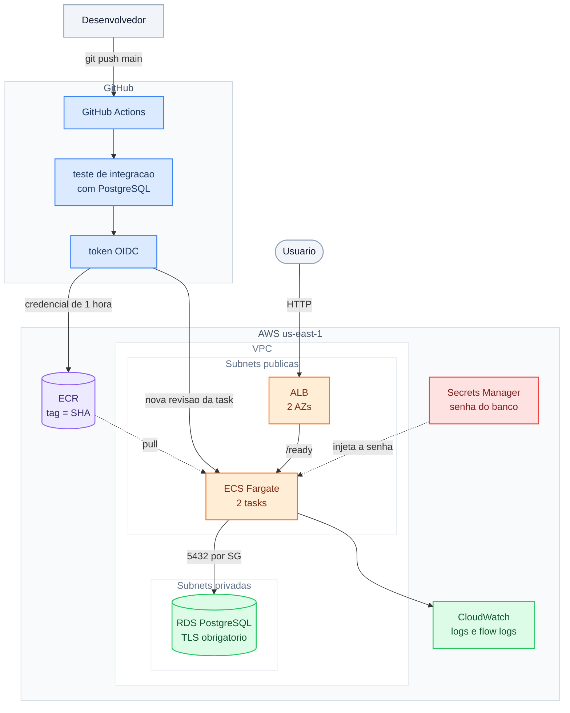

# Arquitetura — devops-02-ecs-microservice



## Fluxo de requisição

1. O usuário chama o ALB, que está em duas zonas de disponibilidade.
2. O ALB só encaminha para tasks que respondem `200` em `/ready` — ou seja, que
   têm conexão com o banco.
3. A task consulta o RDS na porta 5432, com TLS. O security group do banco só
   aceita origem do security group das tasks.

## Fluxo de deploy

1. Push na `main` com mudança em `app/` dispara o workflow.
2. **build-and-test**: builda a imagem e roda teste de integração contra um
   PostgreSQL real, subido como service container do próprio GitHub Actions.
3. O job troca o token OIDC do GitHub por credencial AWS de 1 hora e publica a
   imagem no ECR com a tag do SHA do commit.
4. **deploy**: baixa a task definition atual, troca a imagem, registra uma nova
   revisão e atualiza o serviço.
5. O ECS sobe as tasks novas, espera passarem no health check, drena as antigas
   e as desliga. O job só termina verde quando o serviço estabiliza.

## Onde cada recurso é criado

| Camada | Módulo |
|---|---|
| VPC, subnets, rotas, flow logs, security group default | `terraform/modules/network` |
| Repositório de imagens | `terraform/modules/ecr` |
| Bucket do state (camada separada, state local) | `bootstrap/` |
| Banco, parameter group, security group, log groups do RDS | `terraform/modules/rds` |
| ALB, target group, bucket de logs de acesso | `terraform/modules/alb` |
| Cluster, task definition, serviço, roles das tasks, log groups da app e do Container Insights | `terraform/modules/ecs_service` |
| Provider OIDC e role do pipeline | `terraform/modules/pipeline_identity` |

## Ciclo de vida

```
bootstrap apply → terraform apply → (uso) → terraform destroy
               → limpeza das task definitions do pipeline → bootstrap destroy
```

O bucket do state nasce primeiro e morre por último. Ao fim do ciclo, a conta
não guarda nenhum recurso do projeto, o que é conferido por
`scripts/verificar-cobranca.sh`.
