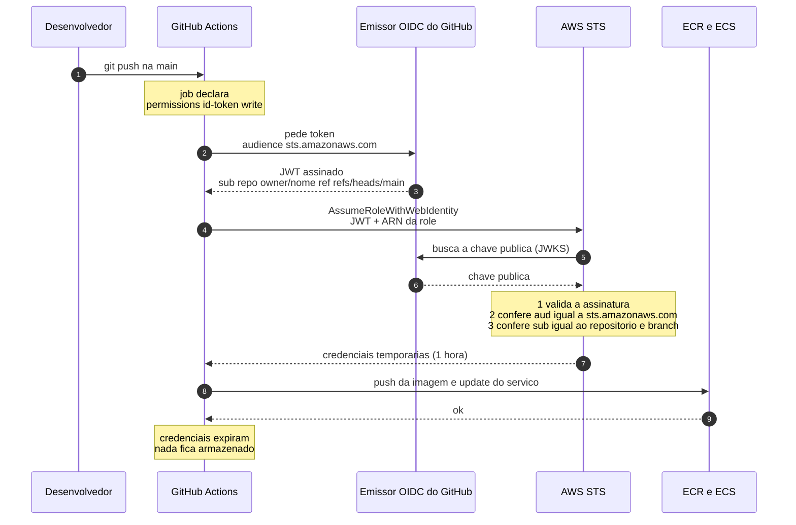

# Autenticação do pipeline na AWS via OIDC

Não existe nenhuma credencial da AWS guardada no GitHub. O único secret do
repositório é o `AWS_ROLE_ARN`, que é um identificador — não uma chave.



## Por que isso é melhor que access key

| | Access key em secret | OIDC |
|---|---|---|
| O que fica guardado no GitHub | Credencial permanente | Só o ARN da role |
| Validade | Até alguém revogar | 1 hora |
| Se vazar | Serve para quem pegar | Inútil sem um token do repositório certo |
| Rotação | Manual | Não existe o que rotacionar |
| Quem pode usar | Qualquer um com a chave | Só a branch declarada na trust policy |

## A peça que faz isso valer

A segurança inteira depende de uma condição na trust policy da role:

```json
"token.actions.githubusercontent.com:sub": "repo:robson-devops/devops-02-ecs-microservice:ref:refs/heads/main"
```

Sem ela, **qualquer workflow de qualquer repositório do GitHub** conseguiria
assumir a role — porque o emissor OIDC é o mesmo para todo mundo. É o erro
mais comum de quem configura OIDC pela primeira vez: registrar o provider,
criar a role e esquecer de amarrar o `sub`.

O `aud` sozinho não basta: `sts.amazonaws.com` é o valor que todo mundo usa.

## Onde cada parte está no código

| Parte | Arquivo |
|---|---|
| Provider OIDC e trust policy | `terraform/modules/pipeline_identity/main.tf` |
| Permissões da role | mesma arquivo, `data "aws_iam_policy_document" "pipeline"` |
| Pedido do token e troca por credencial | `.github/workflows/ci-cd.yml`, passo `configure-aws-credentials` |
